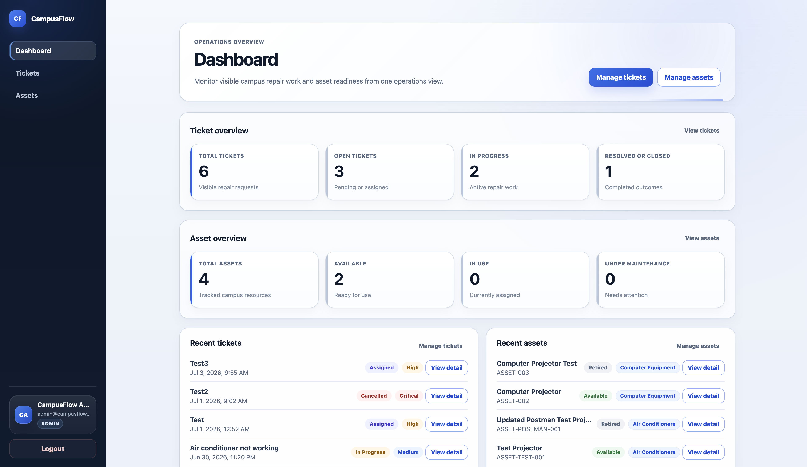
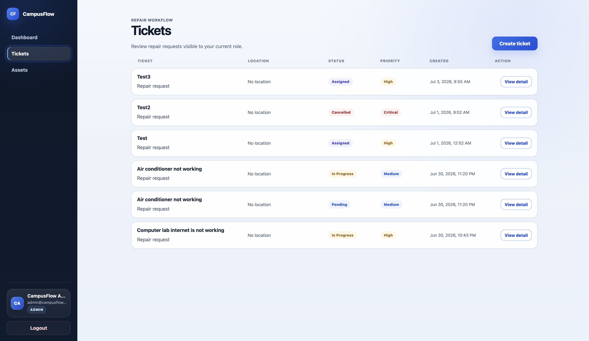
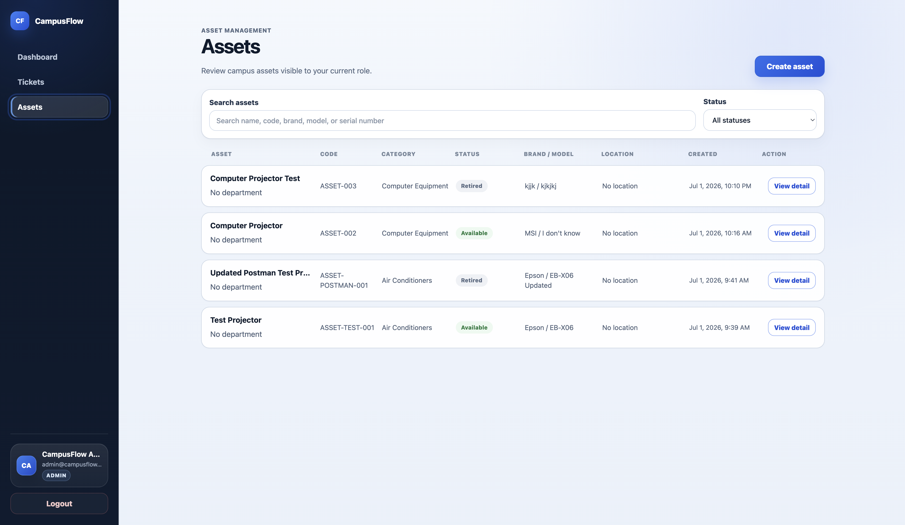
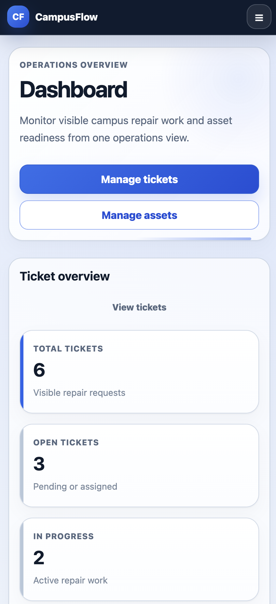
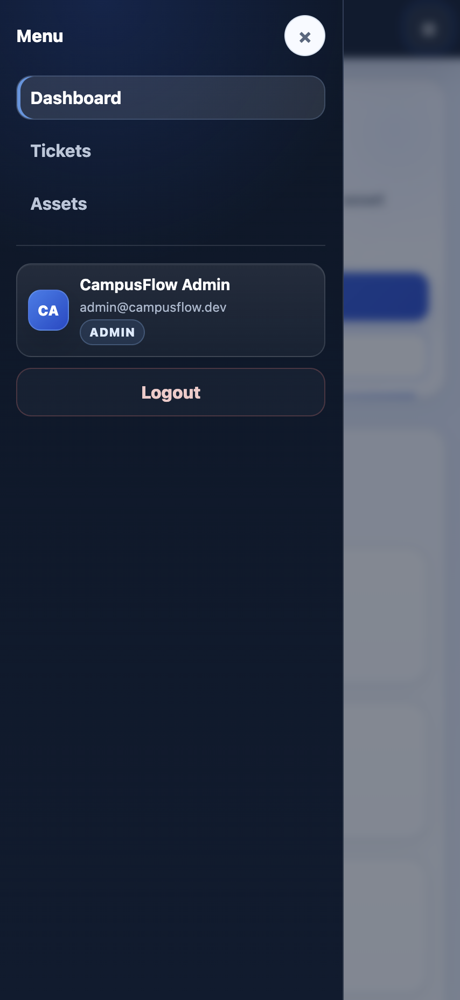
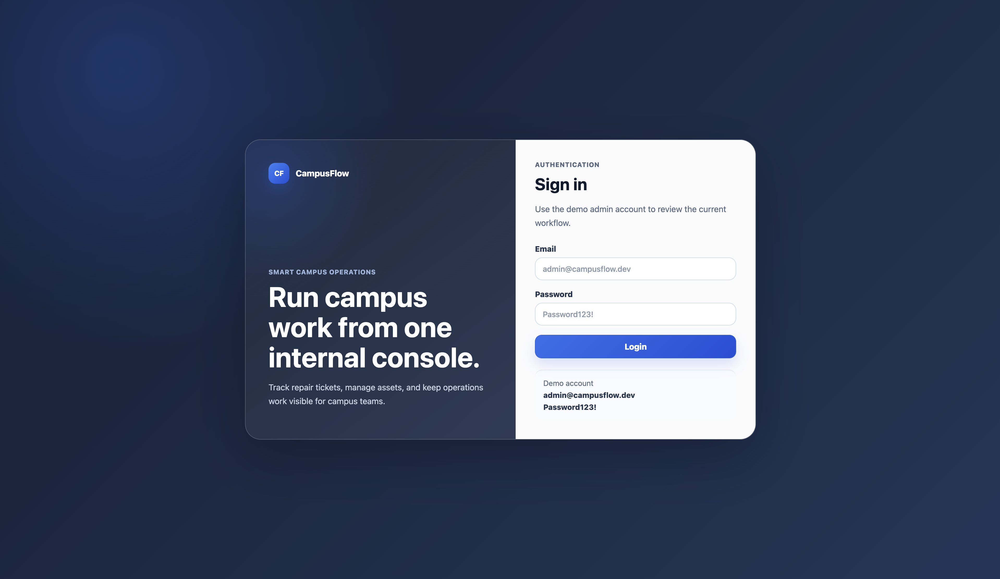
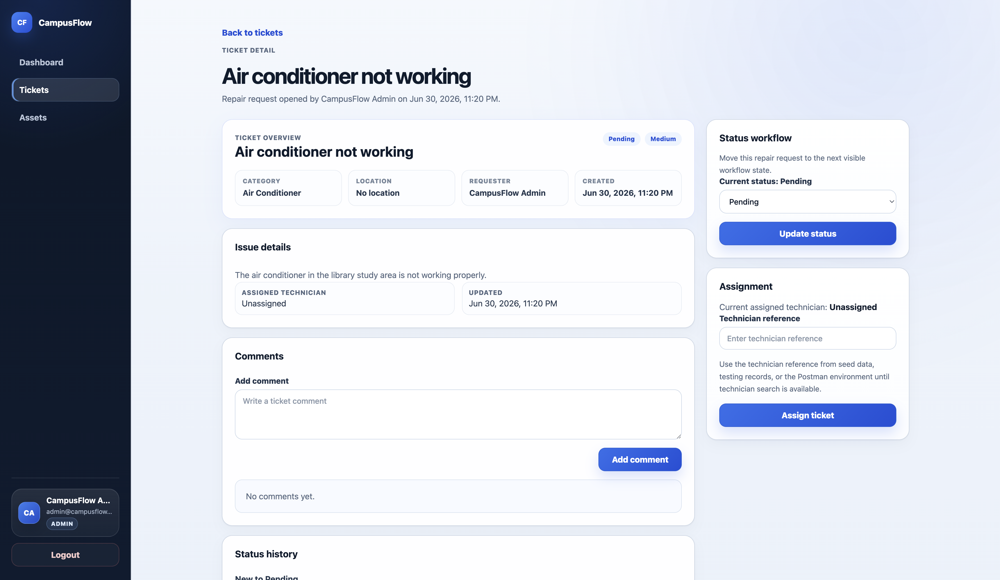
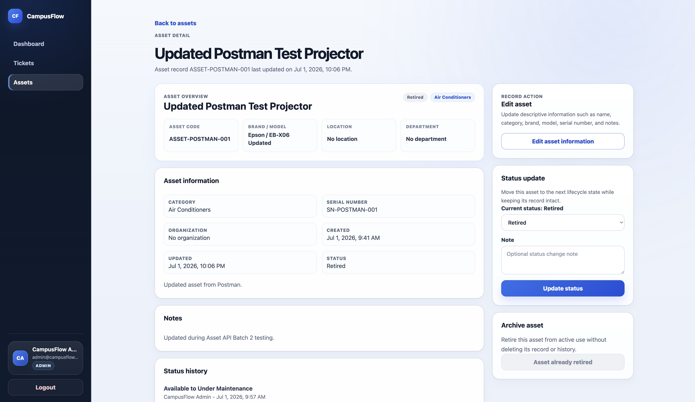

<div align="center">


<br />


<br />
<br />

<p>
  <b>A full-stack portfolio project for campus repair tickets, asset tracking, and operations visibility.</b>
</p>

<p>
  CampusFlow demonstrates practical frontend workflows, backend API design, relational database modeling,
  authentication, role-based authorization, Postman testing, and responsive admin-dashboard UI.
</p>

<p>
  <a href="#preview"><b>Preview</b></a>
  &nbsp;|&nbsp;
  <a href="#key-features"><b>Features</b></a>
  &nbsp;|&nbsp;
  <a href="#local-development"><b>Run Locally</b></a>
  &nbsp;|&nbsp;
  <a href="./docs/testing-plan.md"><b>Testing</b></a>
  &nbsp;|&nbsp;
  <a href="./docs/system-overview.md"><b>System Overview</b></a>
</p>

</div>

<hr />

<h2 align="center">Overview</h2>

<p align="center">
  <b>CampusFlow</b> is an active full-stack portfolio project that simulates a smart campus or internal operations platform.
</p>

<p align="center">
  It is not presented as a finished enterprise product. It is a portfolio-ready core workflow built in small milestones to show clean implementation, testing discipline, documentation, and product-focused iteration.
</p>

<div align="center">

| Area | Current Status |
| ---- | -------------- |
| Project Type | Full-stack portfolio project |
| Core Workflow | Authentication, tickets, assets, dashboard |
| Frontend Status | Responsive desktop, laptop, tablet, and mobile UI |
| Backend Status | Auth, Ticket, and Asset APIs implemented |
| Testing Status | Postman collection and manual testing docs included |
| Future Modules | Booking, inventory, reports, automation, deployment |

</div>

<hr />

<h2 id="preview" align="center">Preview</h2>

<div align="center">
  
</div>

<br />

<div align="center">
  
  &nbsp;
  
</div>

<br />

<div align="center">
  
  &nbsp;
  
</div>

<hr />

<h2 id="key-features" align="center">Key Features</h2>

<table align="center">
  <tr>
    <th>Feature</th>
    <th>Description</th>
  </tr>
  <tr>
    <td><b>Authentication</b></td>
    <td>JWT login, current user lookup, protected frontend routes, and logout flow.</td>
  </tr>
  <tr>
    <td><b>Ticket Management</b></td>
    <td>Create, list, view, assign, update status, and add comments to repair tickets.</td>
  </tr>
  <tr>
    <td><b>Asset Management</b></td>
    <td>Create, list, view, update, change status, search/filter, and safely archive assets.</td>
  </tr>
  <tr>
    <td><b>Dashboard</b></td>
    <td>Ticket and asset summaries with recent activity using existing API data.</td>
  </tr>
  <tr>
    <td><b>Role-Based Access</b></td>
    <td>Backend authorization for admin, manager, technician, and user workflows.</td>
  </tr>
  <tr>
    <td><b>Responsive UI</b></td>
    <td>Desktop sidebar, mobile topbar/drawer, responsive cards, modals, tables, and pagination.</td>
  </tr>
  <tr>
    <td><b>API Testing</b></td>
    <td>Postman collection, local environment, response tests, and manual API testing documentation.</td>
  </tr>
</table>

<hr />

<h2 align="center">Built With</h2>

<div align="center">

| Frontend | Backend | Database | Testing / Tooling |
| -------- | ------- | -------- | ----------------- |
| React | Node.js | PostgreSQL | Postman |
| TypeScript | Express | Prisma ORM | Manual QA docs |
| Vite | JWT | Prisma migrations | Docker Compose |
| React Router | bcrypt | Seed data | API checklists |
| Axios | Zod | Relational models | Responsive QA |
| CSS | Role middleware | Status logs | GitHub docs |

</div>

<hr />

<h2 align="center">Application Flow</h2>

```txt
User
  |
  v
Login with demo account
  |
  v
JWT authentication
  |
  v
Protected React routes
  |
  v
Dashboard / Tickets / Assets
  |
  v
Express API
  |
  v
Prisma ORM
  |
  v
PostgreSQL database
```

<hr />

<h2 align="center">Screenshots</h2>

<h3 align="center">Login</h3>

<div align="center">
  
</div>

<br />

<h3 align="center">Dashboard</h3>

<div align="center">
  
</div>

<br />

<h3 align="center">Tickets</h3>

<div align="center">
  
</div>

<br />

<h3 align="center">Ticket Detail</h3>

<div align="center">
  
</div>

<br />

<h3 align="center">Assets</h3>

<div align="center">
  
</div>

<br />

<h3 align="center">Asset Detail</h3>

<div align="center">
  
</div>

<br />

<h3 align="center">Mobile Responsive</h3>

<div align="center">
  
  &nbsp;
  
</div>

<hr />

<h2 align="center">Backend API</h2>

### Auth API

| Method | Endpoint | Description |
| ------ | -------- | ----------- |
| POST | `/api/auth/register` | Register a new user |
| POST | `/api/auth/login` | Login and receive JWT token |
| GET | `/api/auth/me` | Get current authenticated user |

### Ticket API

| Method | Endpoint | Description |
| ------ | -------- | ----------- |
| GET | `/api/ticket-categories` | Get ticket categories |
| POST | `/api/tickets` | Create ticket |
| GET | `/api/tickets` | Get ticket list |
| GET | `/api/tickets/:id` | Get ticket detail |
| PATCH | `/api/tickets/:id/status` | Update ticket status |
| PATCH | `/api/tickets/:id/assign` | Assign ticket to technician |
| POST | `/api/tickets/:id/comments` | Add ticket comment |

### Asset API

| Method | Endpoint | Description |
| ------ | -------- | ----------- |
| GET | `/api/asset-categories` | Get asset categories |
| POST | `/api/assets` | Create asset |
| GET | `/api/assets` | Get asset list |
| GET | `/api/assets/:id` | Get asset detail |
| PATCH | `/api/assets/:id` | Update asset information |
| PATCH | `/api/assets/:id/status` | Update asset status |
| PATCH | `/api/assets/:id/archive` | Safely archive or retire asset |

<hr />

<h2 align="center">Demo Accounts</h2>

Seed data includes local demo users for testing the implemented workflows.

| Role | Email | Password |
| ---- | ----- | -------- |
| Admin | `admin@campusflow.dev` | `Password123!` |
| Technician | `technician@campusflow.dev` | `Password123!` |
| User | `user@campusflow.dev` | `Password123!` |
| Manager | `manager@campusflow.dev` | `Password123!` |

Do not use these credentials outside local development.

<hr />

<h2 id="local-development" align="center">Local Development</h2>

### 1. Start PostgreSQL

From the repository root:

```bash
docker compose up -d
```

### 2. Run the Backend API

```bash
cd apps/api
npm install
npx prisma migrate dev
npm run db:seed
npm run dev
```

Backend URL:

```txt
http://localhost:4000
```

Health check:

```txt
GET http://localhost:4000/health
```

Backend type check:

```bash
npm run check
```

### 3. Run the Frontend Web App

```bash
cd apps/web
npm install
npm run dev
```

Frontend URL:

```txt
http://localhost:5173
```

Frontend production build:

```bash
npm run build
```

<hr />

<h2 align="center">Postman Testing</h2>

Postman files are included for local API testing:

```txt
postman/collections/CampusFlow API.postman_collection.json
postman/environments/CampusFlow Local.postman_environment.json
```

The collection covers the implemented Auth, Ticket, and Asset APIs. The local environment uses demo credentials, localhost URLs, captured IDs, and an empty secret token variable.

<hr />

<h2 align="center">Documentation</h2>

<table align="center">
  <tr>
    <th>Document</th>
    <th>Description</th>
  </tr>
  <tr>
    <td><a href="./PROJECT_CONTEXT.md"><code>PROJECT_CONTEXT.md</code></a></td>
    <td>Project identity, goals, modules, users, and development strategy.</td>
  </tr>
  <tr>
    <td><a href="./docs/system-overview.md"><code>docs/system-overview.md</code></a></td>
    <td>System purpose, workflows, roles, and architecture direction.</td>
  </tr>
  <tr>
    <td><a href="./docs/api-design.md"><code>docs/api-design.md</code></a></td>
    <td>Implemented and planned API route design.</td>
  </tr>
  <tr>
    <td><a href="./docs/database-design.md"><code>docs/database-design.md</code></a></td>
    <td>Database entities, relationships, and Prisma model notes.</td>
  </tr>
  <tr>
    <td><a href="./docs/testing-plan.md"><code>docs/testing-plan.md</code></a></td>
    <td>Manual QA, role checks, responsive checks, and build verification.</td>
  </tr>
  <tr>
    <td><a href="./docs/manual-api-testing.md"><code>docs/manual-api-testing.md</code></a></td>
    <td>Manual API testing guide for Auth, Ticket, and Asset APIs.</td>
  </tr>
  <tr>
    <td><a href="./docs/showcase-checklist.md"><code>docs/showcase-checklist.md</code></a></td>
    <td>Screenshot and portfolio showcase checklist.</td>
  </tr>
</table>

<hr />

<h2 align="center">Repository Structure</h2>

```txt
campusflow-platform/
├── apps/
│   ├── api/              # Express, TypeScript, Prisma backend
│   └── web/              # Vite, React, TypeScript frontend
├── docs/                 # Architecture, API, testing, screenshots, showcase docs
├── postman/              # Postman collection and local environment
├── packages/shared/      # Placeholder for future shared code
├── docker/               # Local database documentation
├── docker-compose.yml    # Local PostgreSQL service
├── PROJECT_CONTEXT.md
├── PROJECT_PLAN.md
├── ROADMAP.md
├── CHANGELOG.md
└── README.md
```

<hr />

<h2 align="center">Future Improvements</h2>

- Booking system
- Inventory and spare parts tracking
- More dashboard reporting and charts
- Deployment documentation
- n8n notification workflows
- Automated test coverage
- AI-ready knowledge base and assistant structure

<hr />

<h2 align="center">Portfolio Goal</h2>

<p align="center">
  CampusFlow is designed to show the ability to plan, build, document, test, and iterate on a realistic full-stack application.
</p>

<p align="center">
  It is suitable for GitHub portfolio review, personal website screenshots, and technical discussion in software developer or QA-focused interviews.
</p>

<hr />

<div align="center">

<p>
  <b>Thank you for reviewing CampusFlow.</b>
</p>

</div>


